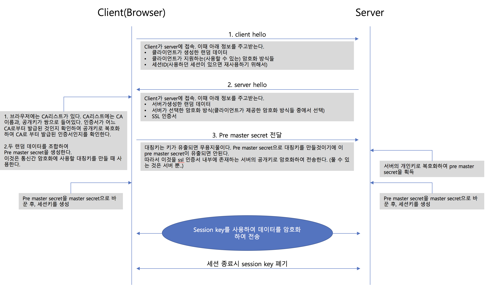

HTTPS와 SSL
===========================

### HTTPS는 무엇일까?
<pre>
HTTP는 Hiper Text Transfer Protocol로, html문서를 주고받기 위한 웹 통신규약이다. HTTP에는 보안적 허술함이 있는데, 특히 중간자 공격에 취약하다.
예를 들어 네이버에 접속한다고 했을때, http통신으로는 내가 접속한 곳이 네이버가 맞는지 확신할 수 없다. (실제로 겉모습을 특정 도메인과 똑같이 하여 사용자의 정보를 빼내는 경우가 있다)

또한, 서버(네이버)와 내가 주고받는 정보들을 중간에서 가로챔으로써, 정보 누출이 쉬우며, 이를 조작하여 나를 행세할 수 있다.

이러한 보안 취약점을 개선하고자 발명된 것이 HTTPS이며 SSL/TLS라는 기술을 근간으로 서비스 된다.
(HTTPS의 'S'는 over Secure Socket Layer 라는 뜻이다.)
</pre>

### SSL/TLS
SSL은 Secure Socket Layer의 약자로, 넷스케이프에 의해 발명되었다. 
SSL이 유명해지자 표준화 기구에서 TLS라는 명칭으로 규정했지만 실제로는 SSL로 더 널리 알려졌다.

<pre>
SSL은 서버를 보증하기 위해 제 3자가 발급하는 인증서다. 여기서 제 3자는 CA (Certificate Authority)라고 불리는 인증기관으로, 많은 인증 기업들이 존재한다.
CA들 중에서 공인된 기업들도 있고 아닌 기업들도 있는데, 공인된 기업이면 보안적으로 공공연히 검증되었다고 생각해도 된다.

이러한 SSL인증서 안에는 다음과 같은 내용이 들어있다.

	1. 서비스 정보 : 인증서를 발급한 CA, 서비스의 도메인 등등 
	2. 서버측 공개키: 공개키의 내용, 공개키의 암호화 방법
</pre>

이제, SSL의 동작원리를 살펴봄으로써 HTTPS가 어떻게 암호화된 데이터를 전송하는지 살펴보자.

### SSL의 원리

ssl은 보안과 성능을 둘 다 만족하기 위해 대칭키, 비대칭키 방식을 혼용하여 사용한다.
이유는 공개키 방식이 보안적으로는 더 뛰어나지만 컴퓨팅 자원을 많이 소모한다. 반면에 대칭키 방식은 컴퓨팅 자원을 적게 소모하여 비대칭키 방식에 비해서는 성능이 좋다.
하지만 대칭키 방식은 키를 탈취당하면 무용지물이라는 단점이 존재한다. 

결과적으로 ssl은 이를 둘다 사용함으로, 두 암호화 방식의 장점을 모두 챙기고자 한다.

tcp 통신에서는 커넥션을 맺기위해서 핸드쉐이크가 존재한다. https에서도 마찬가지이다. 
핸드쉐이크 과정을 통해서 암호화 방식을 결정하고 키를 교환하게 된다.

https의 핸드쉐이크 과정에서 ssl의 원리가 드러난다.

여기서 주의할 것은 ssl에 들어있는 공개키는 서버의 공개키로, 목적은 대칭키 교환시 암호화이다.
인증서를 확인할 때 사용하는 공개키는 ca의 공개키로 브라우저의 CA리스트에 내장되어 있다.

이상 SSL에 대해서 간략하게 살펴보았다.
추가, 수정할 사항이 있으면 업데이트하겠음

