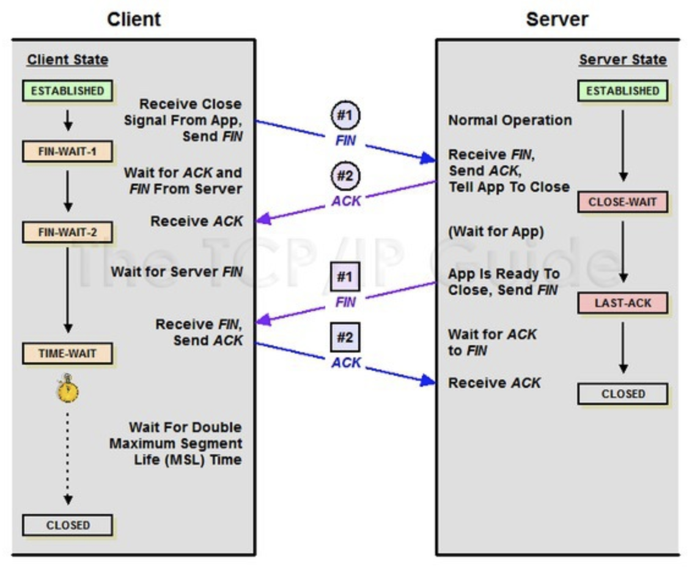

TCP half-closed
===================================================

일반적인 소켓 통신에서 할 일을 다했으면 소켓을 닫는다.
이 때 호출하는 대표적인 메소드의 이름은 close다. (c, c++, java 기준)

나는 작업을 모두 마쳐서 연결을 끊어버리면 되는데, 상대방은 그게 아니라면?
상대방 입장에서는 아직 보낼 데이터가 더 있을 수도, 받고싶은 데이터가 더 있을 수도 있다.

이럴 때 상대방은 나의 연결 중단 메시지를 보고 다급하게 "통신 좀 더 하자"라는 메시지를 보내야한다.

하지만 나는 연결 중단 메시지를 보냄과 동시에 연결을 완전히 끊어버렸다면?
상대방의 메시지를 받을 수 없게 된다.

이러한 일방적인 connection 중단을 방지하기 위한 대책이 half-closed이다.(혹은 half-open이라고도 불린다)

half-closed 상태는 출력스트림만 닫고 입력 스트림은 열어두는 상태이다.
혹시 모를 상대방의 데이터를 받아야만 하므로 입력 스트림은 열어두고, 본인은 더 이상 보낼 데이터가 없기 때문에 출력 스트림은 닫아두는 것이다.

그럼 우리가 흔히 알고 있는 정상적인 종료과정인 4-way handshaking은 어떤 과정일까?

4-way도 half-close로 진행된다.

A와 B가 통신을 하고 있다고 가정하자.
연결을 끊고자 하는 측, A에서 먼저 출력스트림을 닫고 이를 통해 EOF이 상대방 B에게 전달된다.
이를 받은 상대방은 ACK을 보내고 어플리케이션에게 소켓 통신 종료를 요청한다.
어플리케이션이 소켓 종료를 명령하면 B는 비로소 FIN을 A에게 전송한다.

이것이 가능한 이유는 A의 입력 스트림은 열려있기 때문이다.
A가 일방적인 종료를 했다면 B의 ACK, FIN을 받지 못할 것이다.

## 소켓 close
우리가 일반적으로 알고 있는 리눅스의 close, 윈도우의 closesocket 함수는 일방적인 종료이다.
따라서 앞서 살펴본 4-way와 같은 우아한 연결 종료를 기대하긴 힘들다.

따라서 shutdown과 같은 함수로 연결 종료 방식을 설정해야한다. 
